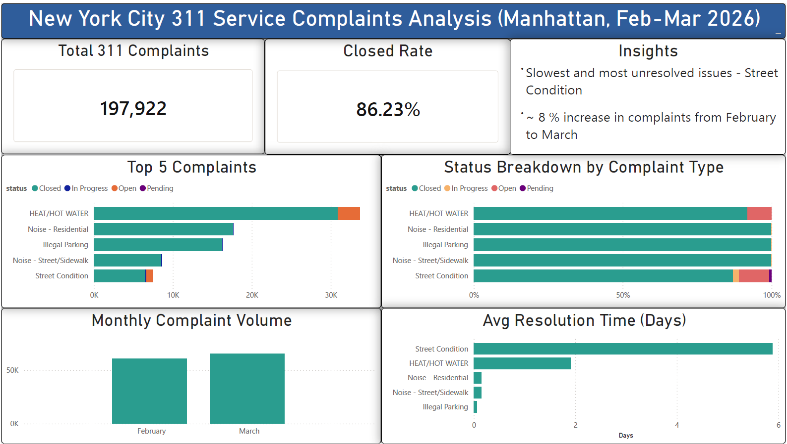

## Dashboard Preview

## NYC 311 Complaints Analysis (Manhattan)

### Overview

This project analyzes NYC 311 service request data to understand complaint trends, resolution performance, and service efficiency in Manhattan. The dataset was cleaned using Python, then visualized in Power BI to identify insights and analysis.

**Tools Used**

Python (Pandas) – data cleaning and preprocessing
Power BI – data visualization and dashboard creation
NYC Open Data – 311 Service Requests dataset

**Insights**

Roughly 86% of complaints are resolved, while the remainder are open or in progress
Street condition complaints have the longest average resolution time (~5.9 days) and highest unresolved proportion
Heat/hot water, noise, and parking-related issues are the most common complaint types
Complaint volume increased by approximately 8% from February to March within the selected time frame

**Dashboard**

The Power BI dashboard includes:

Total complaints and resolution rate overview
Monthly complaint trend analysis
Top 5 complaint types by volume
Status breakdown by complaint category
Average resolution time by complaint type

**Files in this Repository**

notebooks/ → Python data cleaning and preparation
dashboard/ → Power BI report and exported visuals
README.md → Project documentation

**Data Source**

NYC Open Data – 311 Service Requests
https://opendata.cityofnewyork.us/

**Notes**

The dataset is large and was processed locally; therefore, raw data is not included in this repository. A filtered subset close to 198,000 rows was used for analysis and visualization.
